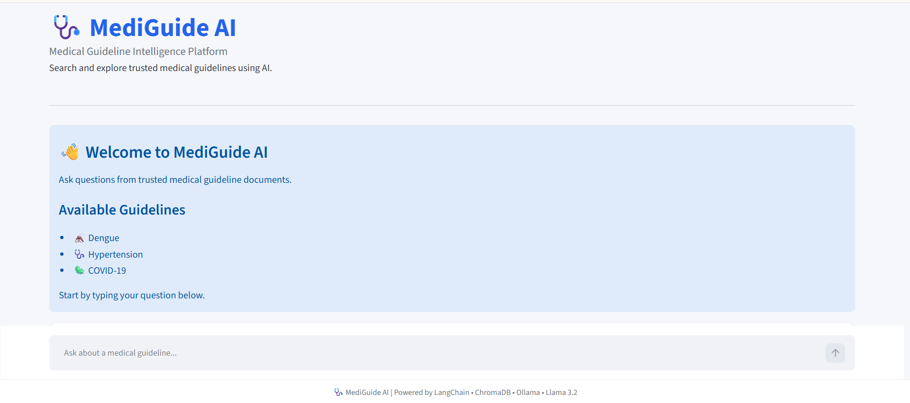
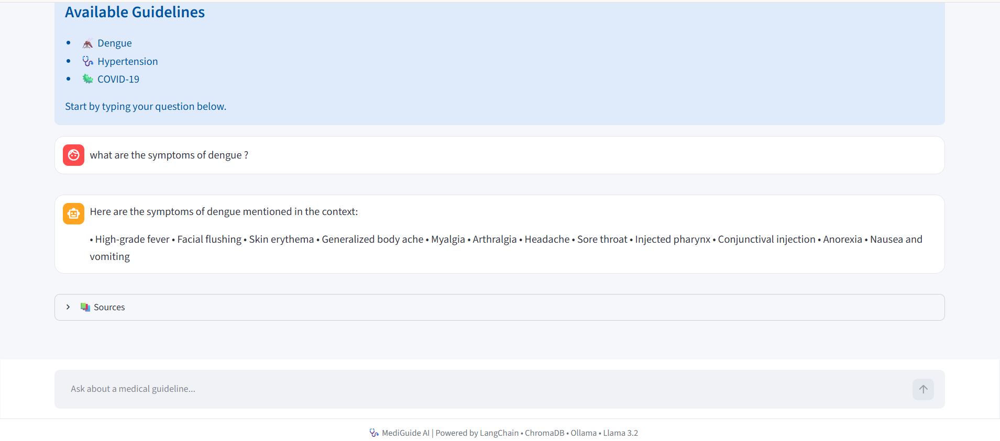

MediGuide AI: Medical Guideline Intelligence Platform

📌 Project Overview

MediGuide AI is an AI-powered Retrieval-Augmented Generation (RAG) application designed to retrieve and provide information from uploaded medical guideline documents. The system processes medical PDFs, extracts and chunks their content, generates embeddings, and stores them in a ChromaDB vector database for semantic retrieval. When a user asks a question, relevant guideline content is retrieved and provided as context to Llama 3.2, which generates a context-grounded response through a Streamlit conversational interface.

🎯 Objectives
Provide an interactive interface for querying medical guidelines.
Retrieve relevant information from uploaded medical documents.
Generate answers using retrieved guideline context.
Display the source document and page number for retrieved information.
Reduce unsupported responses by restricting the LLM to the provided guideline context.
Provide a simple and user-friendly medical guideline search interface.
✨ Key Features
📄 Medical PDF Processing — Processes uploaded medical guideline documents.
🔎 Semantic Search — Finds relevant guideline sections based on user questions.
🧠 RAG Pipeline — Combines document retrieval with LLM-based generation.
🤖 Llama 3.2 — Runs locally through Ollama.
🗃️ ChromaDB — Stores document embeddings for similarity-based retrieval.
💬 Conversational UI — Built using Streamlit.
📚 Source References — Displays document names and page numbers.
🗑️ Clear Chat — Allows users to reset the conversation.
🔒 Guideline-Grounded Responses — Answers are generated using the retrieved guideline context.

## 🛠️ Tech Stack

**Frontend:** Streamlit  
**Backend:** Python  
**RAG Framework:** LangChain  
**LLM:** Llama 3.2:3b  
**LLM Runtime:** Ollama  
**Vector Database:** ChromaDB  
**Embeddings:** Hugging Face  
**Document Processing:** PyPDF

🏗️ System Architecture

Medical Guideline PDFs
        ↓
Document Ingestion
        ↓
Text Extraction & Cleaning
        ↓
Text Chunking
        ↓
Hugging Face Embeddings
        ↓
ChromaDB Vector Database
        ↓
User Question
        ↓
Semantic / MMR Retrieval
        ↓
Relevant Guideline Chunks
        ↓
Prompt + Context
        ↓
Llama 3.2 via Ollama
        ↓
Generated Answer
        ↓
Streamlit UI
        ↓
Answer + Source References
⚙️ Technologies Used
Technology	Purpose
Python	Application development
LangChain	RAG pipeline and LLM integration
ChromaDB	Vector database
Hugging Face Embeddings	Document and query embeddings
Ollama	Local LLM execution
Llama 3.2:3b	Language model
Streamlit	Web application interface
PyPDF	PDF document processing
🔄 Workflow
1. Document Ingestion

Medical guideline PDFs are placed inside the data folder.

PDF Documents
     ↓
Text Extraction
     ↓
Text Cleaning
     ↓
Chunk Creation
     ↓
Embedding Generation
     ↓
ChromaDB

2. Retrieval

When a user asks a question, the system searches the ChromaDB vector database and retrieves the most relevant document chunks.

User Question
      ↓
Query Embedding
      ↓
Similarity / MMR Search
      ↓
Relevant Guideline Chunks

3. Response Generation

The retrieved chunks are combined with the user's question and passed to the Llama 3.2 model.

Question + Retrieved Context
             ↓
       Prompt Template
             ↓
        Llama 3.2
             ↓
       Grounded Answer
       
📂 Project Structure
MediGuide-AI/
│
├── app.py
├── ingest.py
├── requirements.txt
├── .gitignore
│
├── data/
│   └── Medical guideline PDFs
│
├── ingestion/
│   └── Document ingestion modules
│
├── retrieval/
│   └── Retriever implementation
│
├── rag/
│   ├── chain.py
│   ├── llm.py
│   └── prompt.py
│
├── screenshots/
│   └── Application screenshots
│
├── test_chain.py
├── test_llm.py
├── test_prompt.py
└── test_retriever.py
🚀 Installation

Clone the repository:

git clone https://github.com/RISHI20040106/MediGuide-AI.git

Move into the project directory:

cd MediGuide-AI

Create a virtual environment:

python -m venv venv

Activate the environment on Windows:

.\venv\Scripts\Activate.ps1

Install the required packages:

pip install -r requirements.txt
🤖 Ollama Setup

Install Ollama and pull the required model:

ollama pull llama3.2:3b

Verify:

ollama list

The model should appear as:

llama3.2:3b

▶️ Running the Project

If medical guideline PDFs have been added or modified, run the ingestion pipeline:

python ingest.py

Then start the Streamlit application:

streamlit run app.py

Open the application at:

http://localhost:8501
🧪 Testing

The project includes separate test files for different components:

python test_retriever.py

Tests document retrieval.

python test_llm.py

Tests the Llama 3.2 integration.

python test_prompt.py

Tests the prompt template.

python test_chain.py

Tests the complete RAG pipeline.

## 📸 Screenshots

### Dashboard - 1

### Dashboard - 2

## 🔮 Future Enhancements

- Support for additional medical guideline collections
- Multi-document comparison
- Improved source citation and document navigation
- User authentication and personalized chat history
- Conversation history storage
- Deployment to a cloud platform
- Support for additional local and cloud-based LLMs
- Multilingual medical guideline support

## 👥 Team

This project was developed as a group project by:

- **Rishi Kumar**
- **Manthan**

## ⚠️ Disclaimer

MediGuide AI is developed for educational and informational purposes only. It is not intended to provide medical diagnosis, treatment, or professional medical advice. Users should consult a qualified healthcare professional for medical decisions.

